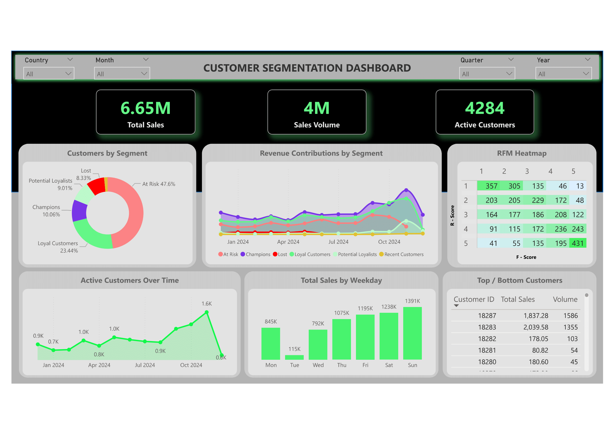

# 🎯 Know Your Customer Better: A Journey Through RFM Analysis

Comprehensive customer segmentation analysis using RFM (Recency, Frequency, Monetary) methodology to identify high-value customers, reduce churn risk, and optimize marketing strategies through data-driven insights and predictive behavioral analysis.

---

## 📌 Table of Contents
- [📋 Project Overview](#-project-overview)
- [💼 Business Problem](#-business-problem)
- [📊 Dataset](#-dataset)
- [📈 Exploratory Data Analysis](#-exploratory-data-analysis)
- [🎯 RFM Analysis & Customer Segmentation](#-rfm-analysis--customer-segmentation)
- [🎨 Customer Segments & Strategic Insights](#-customer-segments--strategic-insights)
- [📊 Interactive Dashboard](#-interactive-dashboard)
- [📈 Business Impact](#-business-impact)
- [👨💻 Author & Contact](#-author--contact)

---

## 📋 Project Overview
This end-to-end project combines advanced RFM (Recency, Frequency, Monetary) analysis with interactive Power BI visualization to transform customer transactional data into actionable business intelligence.  

By analyzing behavioral patterns from e-commerce transactions and creating dynamic dashboards, we enable targeted marketing strategies, churn prevention, and revenue optimization through sophisticated customer relationship management.

**Key Achievement**: Successfully segmented 4,284 customers into 6 strategic segments with an interactive Power BI dashboard, revealing that **31.51% of customers generate 80% of total sales** while providing real-time insights for marketing campaign optimization.

---

## 💼 Business Problem

### The Challenge
Organizations struggle with effective customer segmentation, leading to:
- Generic marketing campaigns that fail to engage different customer groups effectively  
- High churn rates due to inability to identify at-risk customers proactively  
- Missed revenue opportunities from inadequate targeting of high-value segments  
- Poor campaign ROI resulting from broad, unfocused marketing strategies  
- Inefficient resource allocation without understanding customer lifetime value patterns  

### The Solution Objective
Implement comprehensive RFM Customer Segmentation to:
- ✅ Identify high-value customers contributing most to revenue and profit  
- ✅ Detect at-risk customer segments for targeted re-engagement campaigns  
- ✅ Understand purchasing patterns to predict future customer behavior  
- ✅ Optimize marketing strategies delivering personalized offers and experiences  
- ✅ Improve campaign ROI through data-driven segmentation and targeting  

---

## 📊 Dataset

### Data Source & Structure
E-commerce Transactional Dataset containing:
- **541,909 total transaction records** spanning Dec 2023 – Dec 2024  
- Customer purchase history with detailed transaction-level information  
- Product catalog data including stock codes, descriptions, and pricing  
- Geographical coverage across multiple countries with UK as primary market  

### Core Data Schema
- **InvoiceNo**: Unique transaction identifier  
- **StockCode**: Product identification code  
- **Description**: Product description and details  
- **Quantity**: Number of items purchased  
- **InvoiceDate**: Transaction timestamp  
- **UnitPrice**: Price per unit in GBP  
- **CustomerID**: Unique customer identifier (406,829 valid records)  
- **Country**: Customer location data  

### Data Quality Metrics
- **Original Dataset**: 541,909 records  
- **After Cleaning**: 358,308 records (66% retention)  
- Missing CustomerID: 24.93% removed  
- Duplicate Records: 5,526 removed  
- Cancelled Orders: 8,872 removed  
- Non-product Entries: Shipping/adjustments filtered out  

---

## 📈 Exploratory Data Analysis

### Sales Performance Insights (Power BI)
- **Total Sales**: 6.65M with 4M Sales Volume across 4,284 Active Customers  
- **Seasonal Patterns**: Q4 surge (+167% from lowest to highest month)  
- **Weekend Dominance**: Sunday (1,391K) & Saturday (1,238K) highest sales  
- **Opportunity**: Tuesday sales 91% lower than Sunday  

### Customer Value Distribution
- **Pareto Principle**: 31.51% of customers generate 80% of sales  
- **Product Concentration**: 23.75% of products drive 80% of volume  
- **RFM Heatmap**: Correlation between segments & purchase behavior  
- **Geographic Insights**: UK leads, international expansion opportunities  

### Dashboard KPI Monitoring
- Real-time segment tracking  
- Churn risk alerts  
- Segment-wise revenue attribution  

---

## 🎯 RFM Analysis & Customer Segmentation

### RFM Methodology
- **Recency (R)**: Days since last purchase (1 = oldest, 5 = most recent)  
- **Frequency (F)**: Number of transactions (1 = lowest, 5 = highest)  
- **Monetary (M)**: Total purchase value (1 = lowest, 5 = highest)  

Based on RFM Score, Customers mapped into 6 actionable segments.

### Customer Segment Distribution
- **Champions**: 431 (10.1%)   
- **Loyal Customers**: 1,004 (23.4%) 
- **Potential Loyalists**: 386 (9.0%)   
- **Recent Customers**: 67 (1.6%)   
- **At-Risk Customers**: 2,039 (47.6%)  
- **Lost Customers**: 357 (8.3%) 

---

## 🎨 Customer Segments & Strategic Insights

### 🏆 Champions (431)
- **Characteristics**: Top-tier, highest spending  
- **Strategy**: VIP programs, early access, exclusive offers  

### 🤝 Loyal Customers (1,004)
- **Characteristics**: Consistent repeat buyers  
- **Strategy**: Loyalty rewards, bundle promotions  

### 📈 Potential Loyalists (386)
- **Characteristics**: Promising, recent buyers  
- **Strategy**: Onboarding campaigns, targeted discounts  

### ⚠️ At-Risk Customers (2,039)
- **Characteristics**: Declining activity, churn risk  
- **Strategy**: Win-back campaigns, new product highlights  

### 💔 Lost Customers (357)
- **Characteristics**: Long inactive, disengaged  
- **Strategy**: Reactivation incentives, seasonal promotions  

### 🆕 Recent Customers (67)
- **Characteristics**: Newly acquired  
- **Strategy**: Post-purchase follow-up, upsell offers  

---

## 📊 Interactive Dashboard

Here’s the **Power BI Dashboard** showcasing segmentation results, sales performance, and customer insights.  

 

🔗 [View Live Dashboard](https://app.powerbi.com/view?r=eyJrIjoiNmM5YzljYWYtNTM2Zi00ZjIwLWIzZDktNGJkZjAyNWU0MGVhIiwidCI6ImJiNDY2NWQ2LTg4NzItNGIyMy1hY2U3LWFlZjE4YjcxYjBiZiJ9)  

---

## 📈 Business Impact

### 💰 Revenue Optimization
- 31.51% customers drive 80% revenue  
- Champions & Loyal = highest ROI  
- Prevent revenue leakage from 2,039 at-risk customers  

### 🎯 Marketing Efficiency
- Segment-specific targeting → higher conversions  
- Optimized budget allocation  
- Personalized engagement → stronger retention  

### 📊 Operational Excellence
- Lifecycle-based interventions  
- Reduced reactive churn  
- Growth pipeline via Potential Loyalists  

---

## 👨💻 Author & Contact
**Siddhi Vijay Farakate**  
*Data Analyst*  

**Skills Demonstrated**: Python, Pandas, RFM Analysis, Customer Segmentation, Data Visualization, Statistical Analysis, Business Intelligence  

📧 Email: **s.faraakate@gmail.com**  
🔗 [LinkedIn](https://www.linkedin.com/in/sidd-pharakate/)  
